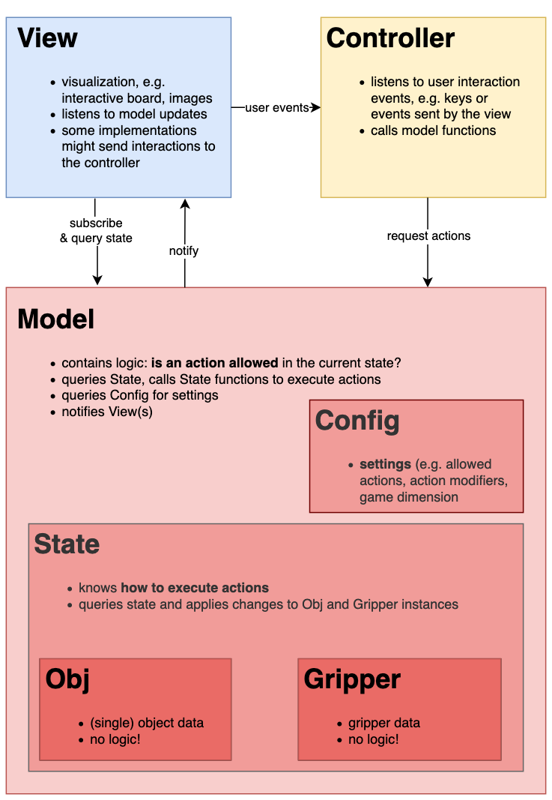

## - work in progress -

# GOLM
## - General Objects for Language-driven Manipulation -

*GOLM* is a framework for creating abstract representations and interfaces to  *object manipulation* tasks. 

#### Example Usages

* building interactive (2D) interfaces for empirical studies involving e.g. the selection or moving around of objects
* reinforcement learning, e.g. with an agent producing commands from the abstract representation or images
* we intend to incorporate GOLM into [slurk][slurk] for crowd-sourcing tasks

## Demo

The folder `demo` holds a simple demo of a browser interface showing a board with Pentomino pieces. A user can manipulate a *'gripper'* to grip and move pieces. 

How to start the demo:

1. Make sure the 3 server components are running. If running them locally, simple run `python3 model/model_api.py`, `python3 view/view_api.py` and `python3 controller/key_controller_api.py` in three different terminal tabs. If the components are running elsewhere, you need to update the URLs in `demo/js/pentoDemo.js`.
2. Open `demo/pentoDemo.html` in a browser. 
3. Press the 'Start' button to begin rendering. You can move the gripper around using the arrow keys and grip using Space or Enter. Use 'Stop' to stop rendering and freeze the current state.

## Architecture

GOLM is realized as a model-view-controller (MVC) architecture. The tasks of each component and the communication between components is sketched out in the following block diagram:

## Extending and customizing the framework

[slurk]: https://clp.ling.uni-potsdam.de/publications/Schlangen-2018.pdf

